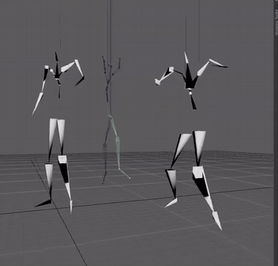

<p align="center">
  
</p>

# OA

**Cross-vendor GPU compute, machine learning, media, audio, and cryptography on Vulkan 1.4.**

OA is a C++/Slang foundation library built around one bindless execution engine and one
compute graph. The same kernels train neural networks on an Intel iGPU, run from Python,
decode and process video, and execute on an Android phone. A consistent Vulkan-native API
targets supported desktop, mobile, and integrated GPUs.

[](https://github.com/realminc/oa/releases)
[](https://github.com/realminc/oa/actions/workflows/ci.yml)
[](https://pypi.org/project/oapython/)
[](LICENSE)

> **0.7 development preview.** OA is real, executable software, but its API and artifact
> formats are not frozen. Verified paths and experimental boundaries are listed below.

> **Current preview.** [`v0.7.7`](https://github.com/realminc/oa/releases/tag/v0.7.7)
> publishes the architecture-converged runtime together with the first coherent
> C++-parity Python surface, paired tutorials, semantic media values, and format-neutral
> still-image I/O. It remains a development preview, not a compatibility promise. The
> `v0.7.5` Build Week evidence is a historical measurement baseline rather than an exact
> benchmark of this release tree.

## What works today

| Area | Current capability |
|---|---|
| **Core / Runtime** | Vulkan device selection, bindless memory, streams, compiled compute graphs, allocator-backed transient aliasing, OaBlasLt routing, semantic DNN planning, pipeline caching, and cache-aware parallel shader preload |
| **ML** | Matrices, modules, autograd, losses, optimizers, checkpoints, validation metrics, packed Transformer projections, Flash Attention, RNN, GRU, Transformer, Mamba-3, and GPU-native dropless sparse MoE |
| **OaAlm** | Native CLIP text conditioning, VQ motion tokenization, Transformer generation, one-file `.oam` deployment, and prompt-to-USD motion generation |
| **Vision** | 50 graph-native image operations, semantic `OaImage` I/O for JPEG/PNG/BMP/TGA plus capability-gated WebP, native container parsing, Vulkan Video decode, encode, capture, recording, and transcoding surfaces |
| **Audio** | WAV/FLAC/MP3 decode, lossless WAV-F32 output, deterministic PCM16 streaming, capture/playback surfaces, and 15 GPU DSP/feature operations |
| **Crypto** | Strict host cryptographic primitives plus Vulkan batch hashing and public-data acceleration; security-sensitive CPU paths use established libraries |
| **Python** | PascalCase C++-parity root values and real `OaFn*` namespace modules, generated type stubs, matrix operators, lazy device creation, paired Core/ML/Audio/Vision tutorials, and the full 16-entry NLP suite over the same native engine |
| **Android** | OaMobileLab runs the five canonical Vulkan NLP models end-to-end on a physical Adreno phone, including training, generation, save, and reload |

The flagship validation is not a synthetic kernel launch. OA trains RNN, GRU,
Transformer, sparse-MoE Transformer, and Mamba-3 language models in FP32 on both a
ThinkPad Iris Xe and an Android Adreno device. The controlled runs use the same corpus,
model contracts, training semantics, generation checks, and checkpoint round trips.

<p align="center">
  <a href="https://x.com/empyrealm1/status/2072364333909037178">
    
  </a>
  <br>
  <em>OaAlm: text-conditioned motion tokens → decoded motion → USD. <a href="https://x.com/empyrealm1/status/2072364333909037178">full clip ↗</a></em>
</p>

## Quick start

### C++

```cpp
#include <Oa/Oa.h>

int main() {
	auto result = OaEngine::Create({.AppName = "QuickStart"});
	if (not result.IsOk()) return 1;
	auto engine = std::move(*result);
	auto x = OaFnMatrix::Ones(OaMatrixShape{1024, 1024});
	auto y = OaFnMatrix::Mul(x, x);
	if (not engine->GetContext().Execute().IsOk()) return 1;
	return engine->GetContext().Sync().IsOk() ? 0 : 1;
}
```

### Python

Install the Linux preview wheel as `oapython`; import it as `oa`:

```bash
python -m pip install oapython
```

```python
from oa import *

audio = OaAudioDecoder.LoadFile("speech.flac")
clean = OaFnAudio.Normalize(audio, -3.0)
OaAudioEncoder.SaveWavF32("speech_clean.wav", clean)
```

The import is host-only; the first device-backed request initializes the binding host.
Python calls the same C++ objects and Vulkan kernels. It is not a CPU reimplementation.

## Build from source

Requirements: Linux, CMake 3.20+, Ninja, a C++20 compiler, the Vulkan SDK/loader, Slang,
and vcpkg. A Vulkan 1.4 driver is recommended; individual features are capability-gated.

```bash
cmake --preset release
cmake --build Build/Release -j
ctest --test-dir Build/Release --output-on-failure
cmake --install Build/Release --prefix ~/.local
```

Applications consume OA through CMake:

```cmake
find_package(oa CONFIG REQUIRED)
target_link_libraries(my_app PRIVATE oa::oa)
```

### Binary packages

Each [GitHub prerelease](https://github.com/realminc/oa/releases) publishes runtime and
SDK tarballs plus `.deb`, `.rpm`, and `.pkg.tar.zst` packages. The distro packages are
built on Ubuntu 24.04 and require glibc 2.39 or newer.

On Arch Linux:

```bash
paru -S oa-bin oa-sdk-bin       # release binaries
paru -S oa-git oa-sdk-git       # build current source
```

## Architecture

```text
C++ / Python / Android
          │
          ▼
  Core tensor + domain APIs
          │
          ▼
  OaContext compute graph
          │
          ▼
  bindless Vulkan runtime
          │
          ▼
  Slang → standalone SPIR-V pipelines
          │
          ▼
 NVIDIA · AMD · Intel · Qualcomm
```

Operations record into `OaContext`; execution, synchronization, gradients, and resource
lifetimes are centralized rather than reimplemented by every module. Slang imports are
resolved at shader build time, so every embedded SPIR-V entry is independently loadable.
Cold native-pipeline preload is parallel and cache-safe; warm startup remains serial and
fast.

Public headers live under `Source/Public/Oa/`; implementations and shaders live under
`Source/Private/Oa/`; Python mirrors those module boundaries under `Source/Python/`.

## Hardware and verification

| Device class | Verified status |
|---|---|
| NVIDIA RTX | Core/ML and Vulkan Video paths verified; cooperative-matrix/BF16 routes are capability-gated |
| AMD RDNA | Core/ML supported through Vulkan; complete current media matrix still needs hardware reruns |
| Intel Xe / Iris Xe | FP32 training and the 50-op Vision path verified; exact H.264/H.265/AV1 8-bit 4:2:0 fixtures pass on Tiger Lake with Mesa `xe`, while the pinned VP9 level-3.1 fixture is capability-rejected by the level-3.0 driver |
| Qualcomm Adreno | Five-model FP32 NLP training/generation/checkpoint suite verified through OaMobileLab |
| CPU Vulkan | Useful for selected correctness and CI work, not a performance target |

OA queries capabilities and fails closed when a path is unavailable. Cooperative-matrix
and native BF16 routes are additionally protected by driver trust gates because some
drivers advertise features they do not compile correctly.

## Honest preview boundaries

- The public API, `.oam` model format, and Python ABI may change before stable 1.0.
- The GitHub/PyPI wheel currently targets Linux x86-64, CPython 3.12, and glibc 2.39+.
- FP32 is the fully exercised path on the current Iris Xe development system. Native BF16
  and cooperative-matrix performance need renewed validation on supported dGPU hardware.
- Vulkan Video support is codec/profile/device dependent. Release notes identify the
  currently verified hardware paths; unsupported profiles return errors rather than
  silently selecting a software decoder.
- OaAlm now works end-to-end, but the current presentation checkpoint is a small-model
  proof, not a production-quality general motion model.
- Crypto is correctness-tested but has not received an independent security audit. Do
  not market it as certified, military-grade, or suitable for custody without review.
- Cross-machine distributed execution and a generic 3D engine/editor are not part of
  this preview. `OaViewer` is the shipped compact presentation path; the Lunar Lander 3D
  tutorial remains Experimental rather than a general rendering claim.

## Documentation

- [GitHub releases](https://github.com/realminc/oa/releases)
- [Changelog](CHANGELOG.md)
- [NLP training benchmark](Docs/Benchmarks/OaNlpSuite.md)
- [Desktop/mobile NLP validation](Docs/Benchmarks/OaMobileLab.md)
- [OpenAI Build Week project](BUILD_WEEK.md)
- [C++ examples](Examples)
- [Tutorials](Tutorial)

Public guides are published at [dev.realm.software](https://dev.realm.software/).

## License

[Business Source License 1.1](LICENSE). Source is available for reading, modification,
non-production use, and the production uses permitted by OA's Additional Use Grant. Each
version converts to Apache-2.0 on its stated Change Date. Commercial licensing:
`realminc.depravity737@passinbox.com`.

Copyright © 2025–2026 Lukasz Biernat, trading as Realm.

OA vendors or integrates permissively licensed components. Release packages
include OA's license, the attribution manifest, and available dependency
copyright files. See [NOTICE.md](NOTICE.md) for the exact dependency boundary,
including components used only by tests or build tooling.
