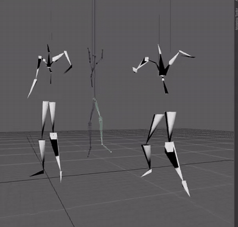

<p align="center">
  
</p>

# OA

**Powerful accelerators. Surrounded by glue.**

OA—One API, Open Architecture—is a unified, GPU-first C++20 and Python library:
one execution system for numerical computing, machine learning, vision, audio,
media, data, crypto, rendering, interfaces, and plotting.

A useful intelligent system does not end at matrix multiplication. It captures or
decodes data, transforms it, trains or executes a model, evaluates the result,
preserves state, and then displays, plays, encodes, or transmits the output.
Conventional workflows split that path across libraries, allocators, queues,
runtimes, and language boundaries. Every handoff can add integration work,
conversion, allocation, copying, synchronization, deployment dependencies, or an
opaque fallback.

OA answers with one library, one engine, one resource model, and one completion
contract. `oa::Engine` owns the Vulkan device, memory, queues, scheduling, kernels,
and profiling. Semantic values preserve their domain meaning, stateless `oa::Fn*`
operations transform them, and sessions own stateful activity such as training,
playback, capture, presentation, and MCP control.

[](https://github.com/realminc/oa/releases)
[](https://github.com/realminc/oa/actions/workflows/ci.yml)
[](https://pypi.org/project/oapython/)
[](LICENSE)

> **Current preview.** [`v0.7.15`](https://github.com/realminc/oa/releases/tag/v0.7.15)
> publishes the converged engine and event model, schema-owned C++/Python operations,
> semantic Q4/Q8 inference values, the rewritten Mamba-3 SISO/MIMO paths, local MCP
> training control, the unified Renderer/Ui/Plot presentation stack, per-engine Vulkan
> dispatch isolation, GPU-native Audio processing, exact C++/Python naming parity,
> executable C++/Python examples, a GPU-native Vision augmentation walkthrough,
> unified ML reinforcement/training contracts, Vulkan-native spatial math, native room
> reverb, and checked `oa::Viewer::preview` presentation evidence.
> The API and artifact formats remain pre-1.0 and may change.

## One runtime. Two front ends.

Python is an authoring surface over the same native OA values, operations, and
Vulkan execution as C++. Matrices, gradients, optimizer state, and graph execution
remain inside OA rather than moving through a second host implementation between
operations. Devices enter through Vulkan capability checks and qualified execution
routes, never through a brand allow-list; unsupported paths fail closed instead of
silently changing the workload.

## What ships in 0.7.15

| Area | Shipped surface |
|---|---|
| **Core / Runtime** | One pinned `oa::Engine`, explicit `submit`/`oa::Event` completion, reusable `oa::ExecutionPlan` capture, bindless allocation, semantic DNN planning, kernel routing, pipeline caching, calibrated clocks, and execution diagnostics |
| **Ml** | Matrices, modules, autograd, AdamW/Muon/SGD, losses, metrics, model files, checkpoints, RNN, GRU, Transformer, Flash Attention, dropless sparse MoE, grouped-state Mamba-3 SISO/MIMO, and native environment/rollout/replay/PPO/DQN/SAC contracts |
| **Quantized inference** | Semantic `oa::QuantMatrix`, explicit Q4/Q8 pack/dequantize, fused `matMulNt`, and `.oam` v3 Dense/Q4/Q8 storage; Q4/Q8 are inference encodings, not training dtypes |
| **Vision / Media** | 50 graph-native image operations, JPEG/PNG/BMP/TGA and capability-gated WebP I/O, native container parsing, Vulkan Video decode/encode surfaces, capture, playback, recording, and transcoding sessions |
| **Audio** | WAV/FLAC/MP3 decode, WAV-F32 output, deterministic PCM16 streaming, capture/playback sessions, and GPU-native feature extraction, normalization, resampling, saturation, native room reverb, block-parallel zero-state Biquad, and one-to-64-section SOS operations with Python parity |
| **Render / Ui / Plot** | One bounded `oa::Renderer` for mesh or Ui composition, headless and swapchain presentation, unified `oa::Viewer::preview` for checked image/audio/video paths and direct GPU values, GPU-composed retained figures, Line/Scatter/Bar/Histogram/Heatmap/Image artists, dark/light themes, and deterministic PNG output |
| **MCP** | Local newline-delimited stdio JSON-RPC/MCP server primitives and guarded live-training controls through `oa::McpTraining` |
| **Python** | One C++-parity surface with PascalCase types, camelCase operations, lowercase modules, generated stubs, lazy engine creation, paired examples/tutorials, and the same native Vulkan implementation |
| **Crypto** | Strict host cryptographic primitives plus Vulkan batch hashing and public-data acceleration; no independent security audit is claimed |
| **VLM** | Bounded Vulkan-native vectors, quaternions, matrices, transforms, projection, interpolation, and coordinate conversion under one right-handed Vulkan convention |

The canonical NLP suite trains RNN, GRU, dense Transformer, sparse-MoE Transformer,
and Mamba-3 with Byte, BPE, and Char tokenizers through the same autograd, optimizer,
metrics, generation, and checkpoint path. The current Iris Xe evidence includes all 15
complete 300-step workloads. The controlled `v0.6.105` → `v0.6.106` comparison found no
accepted regression across its 12 non-Mamba rows and 21–48% lower median step time for
the six Transformer/MoE rows; Mamba-3 was subsequently rewritten and is reported
separately because the old paired baseline was thermally invalid. See the
[NLP benchmark](docs/external/benchmarks/oaNlpSuite.md) for the exact estimators, spread, commits,
driver, and rejected runs.

<p align="center">
  <a href="https://x.com/empyrealm1/status/2072364333909037178">
    
  </a>
  <br>
  <em>OA ALM: text-conditioned motion tokens → decoded motion → USD. <a href="https://x.com/empyrealm1/status/2072364333909037178">full clip ↗</a></em>
</p>

## Quick start

### C++

```cpp
#include <oa/oa.h>

#include <array>
#include <cmath>
#include <utility>

int main() {
	oa::EngineConfig config;
	config.appName = "QuickStart";
	config.precision = oa::Precision::FP32;

	auto created = oa::Engine::create(config);
	if (not created.isOk()) return 1;
	auto engine = std::move(created).getValue();

	auto a = oa::FnMatrix::ones({2, 3});
	auto b = oa::FnMatrix::full({2, 3}, 2.0F);
	auto c = oa::FnMatrix::add(a, b);

	auto submitted = engine->submit();
	if (not submitted.isOk()) return 1;
	if (not engine->wait(submitted.getValue()).isOk()) return 1;

	std::array<oa::F32, 6> values{};
	if (not oa::FnMatrix::copyToHost(c, values.data(), sizeof(values)).isOk()) return 1;
	return std::abs(values[0] - 3.0F) <= 1e-5F ? 0 : 1;
}
```

The operation records semantic work. `submit()` returns the exact `oa::Event`; waiting
that event is the explicit completion boundary. For reusable work, capture once with
`engine->capture(...)` and resubmit the returned `oa::ExecutionPlan`.

### Python

Install the Linux preview wheel as `oapython`; import it as `oa`:

```bash
python -m pip install oapython
```

```python
import oa

a = oa.FnMatrix.ones([2, 3])
b = oa.FnMatrix.full([2, 3], 2.0)
c = oa.FnMatrix.add(a, b)
print(oa.FnMatrix.copyToHost(c))
```

Import is host-only. The first device-backed request creates the binding host lazily.
Python calls the same C++ values and Vulkan kernels; it is not a NumPy or CPU fallback.

## Build from source

Requirements: Linux, CMake 3.20+, Ninja, a C++20 compiler, the Vulkan SDK/loader,
Slang, and vcpkg. Vulkan 1.4 is the release target; individual routes remain
capability-gated.

```bash
cmake --preset release
cmake --build build/release -j
ctest --test-dir build/release --output-on-failure
cmake --install build/release --prefix ~/.local
```

Applications consume OA through CMake:

```cmake
find_package(oa CONFIG REQUIRED)
target_link_libraries(my_app PRIVATE oa::oa)
```

### Binary packages

Each [GitHub prerelease](https://github.com/realminc/oa/releases) builds runtime and SDK
tarballs plus `.deb`, `.rpm`, and `.pkg.tar.zst` packages. These packages are built on
Ubuntu 24.04 and require glibc 2.39 or newer.

On Arch Linux:

```bash
paru -S oa-bin oa-sdk-bin       # release binaries
paru -S oa-git oa-sdk-git       # current source
```

## Architecture

```text
C++ / Python / Android
          │
          ▼
 semantic values + oa::Fn* operations + sessions
          │
          ▼
 oa::Engine ── capture → oa::ExecutionPlan
            └─ submit  → oa::Event
          │
          ▼
 private semantic lowering + Vulkan execution graph
          │
          ▼
 embedded Slang → SPIR-V kernel manifest
```

The public API does not expose Vulkan graphs, queues, allocators, routers, pipeline
objects, or a public `oa::ExecutionSession`. Values carry domain semantics even when storage can be
shared. Operations are stateless transformations. Sessions own stateful external or
iterative processes. `oa::Engine` is the sole local execution owner; presentation, media,
training, and MCP services borrow it through composition.

Public headers live under `source/cpp/include/oa/`; implementations and shaders
under `source/cpp/lib/oa/`; vendored C/C++ dependencies under
`source/cpp/thirdparty/`; Python mirrors the public module boundaries under
`source/py/`.

## Hardware and verification

| Device class | Evidence for this release line |
|---|---|
| **Intel Iris Xe TGL GT2** | Current local acceptance pack: FP32 Core/Ml, the 15-workload NLP suite, Q4/Q8, grouped Mamba-3, Vision, Plot/Ui/Renderer, Python, and separate core/synchronization/GPU-assisted validation; exact video support remains profile-specific |
| **Qualcomm Adreno 610** | Earlier physical OaMobileLab checkpoint ran the five Byte NLP models through training, generation, save, and reload; the complete 0.7.15 tree has not been requalified on this device |
| **NVIDIA / AMD / newer Adreno / datacenter** | Capability-gated implementations exist, but the complete 0.7.15 tree is unverified on these hardware packs and no current performance claim is made |
| **CPU Vulkan** | Useful for selected correctness and hosted-CI work; not a performance target and not a substitute for the real-GPU gate |

OA queries capabilities and fails closed when a route is unavailable. Native BF16 and
cooperative-matrix paths need fresh device-specific validation. FP64 appears only as
fail-closed vocabulary until a scientific numerical pack is implemented and proven.

## Preview boundaries

- The public API, Python ABI, and `.oam` format may change before 1.0.
- The GitHub/PyPI wheel targets Linux x86-64, CPython 3.12, and glibc 2.39+.
- Vulkan Video is codec/profile/device dependent; unsupported profiles return an error
  instead of silently selecting a software decoder.
- `oa::Renderer` is a compact mesh/Ui presentation layer, not a scene graph, material/PBR
  renderer, DCC, or general game engine. Plot output is retained and GPU-composed, but
  interactive plot navigation remains future work.
- MCP is a local control plane, not a remote transport or high-frequency tensor data
  plane. Cross-machine distributed execution and physical heterogeneous collectives are
  not part of this preview.
- OA ALM is an end-to-end small-model demonstration, not a production-quality general
  motion model.
- Crypto is correctness-tested but has not received an independent security audit. Do
  not represent it as certified or suitable for custody without review.
- GitHub-hosted CI proves build, host sanitizer, generation, and packaging contracts.
  The real-GPU job is conditional until a persistent runner is provisioned; the current
  GPU evidence is the recorded physical Iris Xe pack.

## Documentation

- [Developer documentation](https://dev.realm.software/)
- [GitHub releases](https://github.com/realminc/oa/releases)
- [Changelog](CHANGELOG.md)
- [NLP training benchmark](docs/external/benchmarks/oaNlpSuite.md)
- [Desktop/mobile NLP validation](docs/external/benchmarks/oaMobileLab.md)
- [C++ tutorials](sdk/cpp/tutorials)
- [Python tutorials](sdk/py/tutorials)

## License

[Business Source License 1.1](LICENSE). Source is available for reading, modification,
non-production use, and the production uses permitted by OA's Additional Use Grant. Each
version converts to Apache-2.0 on its stated Change Date. Commercial licensing:
`realminc.depravity737@passinbox.com`.

Copyright © 2025–2026 Lukasz Biernat, trading as Realm.

OA vendors or integrates permissively licensed components. Release packages include
OA's license, the attribution manifest, and available dependency copyright files. See
[NOTICE.md](NOTICE.md) for the exact dependency boundary, including components used only
by tests or build tooling.
