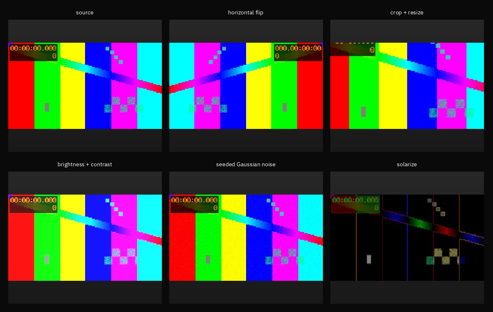

# GPU vision data augmentation

**Status:** Shipped tutorial; performance comparison not yet measured

This tutorial decodes one RGB image, records five deterministic augmentation
views through `oa::FnImage`, and composes the source plus results into one Plot
figure. Pixel transforms and composition run through OA's Vulkan paths. Decode
and the final PNG encode remain explicit host codec boundaries.

The walkthrough covers horizontal flip, center crop plus bilinear resize,
brightness/contrast, seeded Gaussian noise with clamping, and solarization.
The fixed noise seed makes the generated presentation asset reproducible; it
does not imply that production training should reuse one seed indefinitely.



## Run

C++:

```bash
cmake --build build/release --target TutorialVisionDataAugmentation
bin/release/tutorial/vision/tutorialVisionDataAugmentation \
  asset/image/visionTestPattern320x180.jpg \
  /tmp/oa-vision-data-augmentation.png
```

Python:

```bash
python sdk/py/tutorials/vision/tutorialVisionDataAugmentation.py \
  --input asset/image/visionTestPattern320x180.jpg \
  --output /tmp/oa-vision-data-augmentation.png
```

Both programs must produce a 1200×760 PNG containing the same six semantic
views. Their maintained source is
[`tutorialVisionDataAugmentation.cpp`](../../../sdk/cpp/tutorials/vision/tutorialVisionDataAugmentation.cpp)
and
[`tutorialVisionDataAugmentation.py`](../../../sdk/py/tutorials/vision/tutorialVisionDataAugmentation.py).

No throughput comparison is claimed here. A CPU-library comparison belongs in
the benchmark runner with identical decode policy, transforms, output shape,
warmup, fresh-process sampling and correctness checks.
